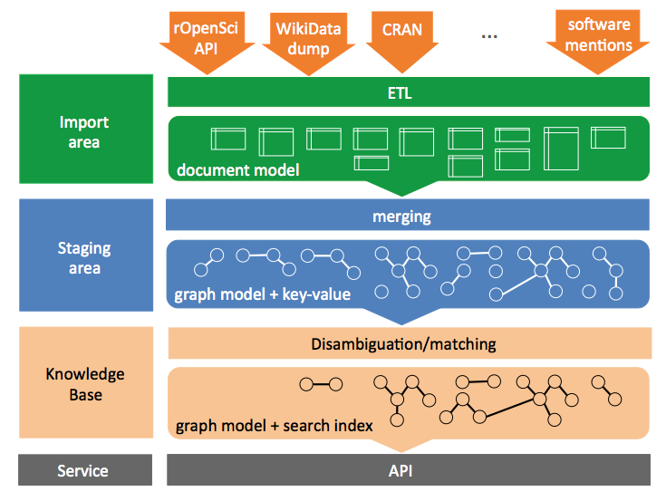

# A Knowledge Base for Research Software

**[Work In Progress]** This project is under development

This repository contains the tools for creating, populating, updating and accessing a Knowledge Base dedicated to research software. It is expected to include as well as a set of Knowledge graph services for various data disambiguation, ranking, analytics, recommendation and data discovery. 

We approximate research software as the set of software mentioned in the scientific litterature, considering that these mentions characterize research usage. The core of the Knowledge Base is thus relying on the import of software mentions automatically extracted from the scientific literature with this [component](https://github.com/ourresearch/software-mentions). We further match mentionned software to software entities from different curated software resources. Via software dependencies, we can then identify relations to more general resources on software, which constitutes an enlarged view on research software, providing a richer view of the research software landscape.  

## Building the Knowledge Base 



## Internal data model

The internal data model of this Knowledge Base is based on the Wikidata data model, see [here](doc/internal_data_model.md). We selected a paradigm focusing on the description of statements about resources (with scoring and probabilistic interpretation) rather than a paradigm designed for describing resources (like RDF). This allows the support of contradicting information, but more particularly of uncertain and noisy information coming from text mining. The data model is independent from any particular inference/query approach in order to take advantage of the existing efficient property graph database and graph algorithm implementations. The data model includes provenance information for every atomic data values using the Wikidata data model mechanisms.

## Requirements and install

The present tools are implemented in Python and should work correctly with Python 3.6 or higher. An ArangoDB version 3.7.* server must be installed, see the [installation](https://www.arangodb.com/download-major/) for the Open Source community server. 

Get the github repo:

```sh
git clone https://github.com/kermitt2/softcite_kb
cd softcite_kb
```
It is strongly advised to setup first a virtual environment to avoid falling into one of these gloomy python dependency marshlands - you can adjust the version of Python to be used, but be sure to be 3.6 or higher:

```sh
virtualenv --system-site-packages -p python3.6 env
source env/bin/activate
```

Install the dependencies:

```sh
pip3 install -r requirements.txt
```

Finally install the project in editable state

```sh
pip3 install -e .
```

## Create the Knowledge Base

The KB uses ArangoDB to store multi-model representations. Be sure to have an ArangoDB server installed and running. Indicate the server host and port of ArangoDB in the config file - if not default (`localhost:8529`) - together with the `username` and `password` to be used for transactions. In the following, we suppose that the config file is `my_config.yaml`, if not indicated the file `config.yaml` at the project root will be used by default. 

During the ingestion and processing of the data, the ArangoDB databases, collections and activity/load can be monitored and further inspected via the ArangoDB web interface (default http://localhost:8529). 

## Populate the Knowledge Base

The main curated sources of data are currently:

- Wikidata software entities and related entities 

- rOpenSci's R-universe package system 

- CRAN package metadata for R ecosystem

- [WIP] public information available via GitHub API

The extraction of software mentions and citations in the scientific literature is obtained via the [Softcite software mention recognizer](https://github.com/ourresearch/software-mentions) applied to Open Access PDF. 

For a larger list of relevant resources on software, with various levels of curation, see [here](doc/software-resources.md).

The following sections describe how to import these different sources of software information into the system. The initial import and the following updates are currently manual processes, but it is expected to automate this workflow via Apache Airflow in future iterations. For convenience, the imported entities are currently grouped in five vertex collections (`documents`, `organizations`, `licenses`, `persons`, `software`) and relations are grouped in six edge collections (`actors`, `citations`, `copyrights`, `references`, `dependencies`, `funding`). These groups are helpful for the development process and test, but we might consider a single vertex collection and a single edge collection for higher generalization and reusability of the Knowledge Base platform. 


### Import Wikidata software entities

The import is realized via the JSON Wikidata dump. Entities corresponding to software (except video games) are imported to seed the KB, together with some relevant entities in relation to software corresponding to persons, organizations and close concepts (license, programming language, OS). 

A recent full Wikidata json dump compressed with bz2 (which is more compact) is needed, which can be dowloaded [here](https://dumps.wikimedia.org/wikidatawiki/entities/). There is no need to uncompressed the json dump.

The import is launched as follow, with `latest-all.json.bz2` as Wikidata dump file:

```bash
python3 software_kb/importing/Wikidata_import.py --config my_config.yaml latest-all.json.bz2
```

To force the import to recreate the Wikidata database from scratch, use `--reset`.

Note: this import is time-consuming because the complete Wikidata dump is parsed. However it should be done only one time to seed the database. In the next steps and incremental updates, the library uses the Wikidata web API to retrieve missing referenced Wikidata JSON entities.

### Import rOpenSci metadata

From the project root, launch:

```bash
python3 software_kb/importing/rOpenSci_import.py --config my_config.yaml
```

This will populate the rOpenSci import document database from scratch or update it if already present. 

To force the import to recreate the rOpenSci database from scratch, use:

```bash
python3 software_kb/importing/rOpenSci_import.py --config my_config.yaml --reset
```

The import uses a cache to avoid reloading the JSON from the rOpenSci API. The metadata are reloaded only when a new version of a package is available.

### Import CRAN metadata

```
python3 software_kb/importing/cran_import.py --config my_config.yaml
```

To force the import to recreate the CRAN metadata database from scratch, use `--reset`. Similarly to the rOpenSci import, a cache is used to store the metadata pages. 


### Import software mentions 

To import software mentions automatically extracted from scientific literature with https://github.com/ourresearch/software-mentions:

```
python3 software_kb/importing/software_mention_import.py --config my_config.yaml data/mentions/
```

The script expects as parameter the path to the repository where the software mention JSON objects are available (for example `data/mentions/`), obtained with `mongoexport`. `mongoexport` produces 3 JSON file (one JSON object per line) corresponding to 3 collections: `annotations`, `documents` and `references`. Usage of `mongoexport`is as follow:

```bash
> mongoexport -d <database> -c <collection_name> -o <output_file_name>
``` 

The MongoDB JSON export can be compressed with gzip or not. 

### GitHub public data

GitHub public data come as an enrichment of a populated knowledge base. The following import should thus be done last after the import of the other resources. 

[WIP]

## Merging

Once imported, the following command will load the different imported data source into one common space called the "staging area". This area is based on a graph model and a common schema for all sources. Attributes corresponding to strong unambiguous identifiers are also merged in the process, which gives aggregated representations for the software and related entities (persons, license, institutions, ...). 

```bash
python3 software_kb/merge/populate.py --config my_config.yaml
```

The option `--reset` will re-init entirely the staging area. 

Once the staging area has been populated, we can merge/conflate entities based on a matching and disambiguation process:

```bash
python3 software_kb/merge/merge.py --config my_config.yaml
```

The entities are actually not effectively merged at this step, we keep track of merging decisions in some additional dedicated collections. The process can be time-consuming as it involves soft matching and deduplication decisions for all the entities:


```
document merging
entries: 94417 , nb. steps: 95
100%|█████████████████████████████████████████████████████████████| 95/95 [10:34<00:00, 6.68s/it]

organization merging
entries: 1455 , nb. steps: 2
100%|█████████████████████████████████████████████████████████████| 2/2 [00:00<00:00,   7.00it/s]

license merging
entries: 169 , nb. steps: 1
100%|█████████████████████████████████████████████████████████████| 1/1 [00:00<00:00,  88.18it/s]

person merging
entries: 1895 , nb. steps: 2
100%|█████████████████████████████████████████████████████████████| 2/2 [00:11<00:00,   5.75s/it]

software merging
entries: 177238 , nb. steps: 178
  4%|██▋                                                        | 8/178 [12:12<4:19:18, 91.52s/it]
```

## Conflated Knowledge base

The following script launches the creation of the final Knowledge Base using the graph in the staging area and the merging decisions produced by the disambiguation process. The actual merging of entities (vertex) is realized at this stage. Relations (edges) will be updated and deduplicated based on the merged vertex. The result is a denser graph which is the actual Software Knowledge base, stored in an independent third area and used by the API.

```bash
python3 software_kb/kb/knowledge_base.py --config my_config.yaml
```

```
documents kb loading
total documents: 94417 , nb. steps: 95
100%|█████████████████████████████████████████████████████████████| 95/95 [06:03<00:00,  3.83s/it]
number of loaded documents after deduplication: 78534

organizations kb loading
total organizations: 1455 , nb. steps: 2
100%|█████████████████████████████████████████████████████████████| 2/2 [00:04<00:00,  2.37s/it]
number of loaded organizations after deduplication: 1445

licenses kb loading
total licenses: 169 , nb. steps: 1
100%|█████████████████████████████████████████████████████████████| 1/1 [00:00<00:00,  1.95it/s]
number of loaded licenses after deduplication: 168

persons kb loading
total persons: 1895 , nb. steps: 2
100%|█████████████████████████████████████████████████████████████| 2/2 [00:07<00:00,  3.70s/it]
number of loaded persons after deduplication: 1588

software kb loading
total software: 177238 , nb. steps: 178
100%|█████████████████████████████████████████████████████████████| 178/178 [26:36<00:00, 8.97s/it]
number of loaded software after deduplication: 70152

actors relations kb loading
total actors edges: 1655 , nb. steps: 2
100%|█████████████████████████████████████████████████████████████| 2/2 [00:08<00:00,  4.23s/it]

citations relations kb loading
total citations edges: 449579 , nb. steps: 450
100%|█████████████████████████████████████████████████████████████| 450/450 [47:30<00:00, 6.33s/it]

copyrights relations kb loading
total copyrights edges: 0 , nb. steps: 1
100%|█████████████████████████████████████████████████████████████| 1/1 [00:00<00:00, 727.04it/s]

dependencies relations kb loading
total dependencies edges: 86839 , nb. steps: 87
100%|█████████████████████████████████████████████████████████████| 87/87 [06:41<00:00,  4.61s/it]

funding relations kb loading
total funding edges: 0 , nb. steps: 1
100%|█████████████████████████████████████████████████████████████| 1/1 [00:00<00:00, 717.10it/s]

references relations kb loading
total references edges: 171037 , nb. steps: 172
100%|█████████████████████████████████████████████████████████████| 172/172 [13:29<00:00, 4.71s/it]
```

## Incremental update

Incremental update of the imported data is supported. It is thus possible to add the new and updated entries from the data sources by running the same import command sequence as for the initial load. Only the new and updated records will be ingested and merged to the existing databases. Be sure **not** to use the parameter `--reset` in the commands, which erases the existing databases/collections and restarts an ingestion from scratch.  

The update process remains currently manual in the sense that the user has to launches the sequence of command lines (import, merge and KB loading) to drives the update. We plan to use Apache Airflow worflows to entirely automate initial and incremental update, with higher paralellism and efficiency.  

## API

[Work In Progress] This module replaces [softcite-api](https://github.com/kermitt2/softcite-api).

### Start the service

[Work In Progress]

> python3 software_kb/api/service.py --config my_config.yaml

```
INFO:     Started server process [25723]
INFO:     Waiting for application startup.
 ____         __ _                            _  ______       _    ____ ___ 
/ ___|  ___  / _| |___      ____ _ _ __ ___  | |/ / __ )     / \  |  _ \_ _|
\___ \ / _ \| |_| __\ \ /\ / / _` | '__/ _ \ | ' /|  _ \    / _ \ | |_) | | 
 ___) | (_) |  _| |_ \ V  V / (_| | | |  __/ | . \| |_) |  / ___ \|  __/| | 
|____/ \___/|_|  \__| \_/\_/ \__,_|_|  \___| |_|\_\____/  /_/   \_\_|  |___|
                                                                            

INFO:     Application startup complete.
INFO:     Uvicorn running on http://localhost:8050 (Press CTRL+C to quit)
```

The documentation of the service is available at `http(s)://*host*:*port*/docs`, e.g. `http://localhost:8050/docs` (based on Swagger), for ReDoc documentation style, use `http://localhost:8050/redoc`).


