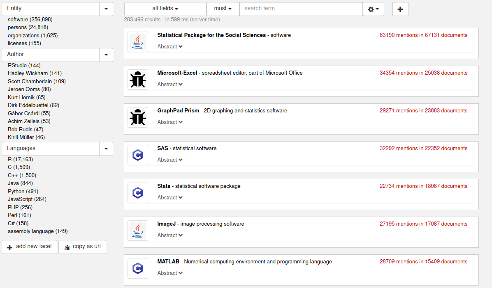
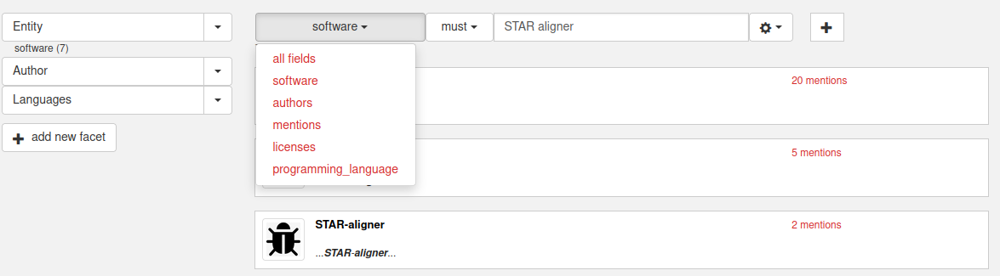
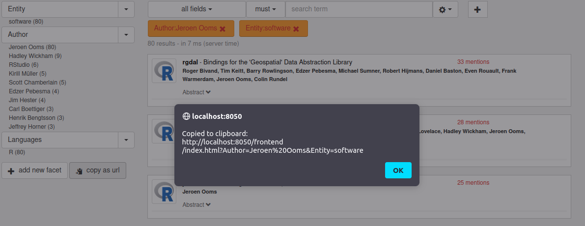

# Simple KB Frontend Linking

## KB frontend

The KB frontend is a facetted search web application allowing to explore the research software entities and their relationships. 



## URL parameters

The frontend is a "single page" web application. However it is possible to access the application to a certain state using URL parameters. Two main types of parameters can be used: 

- **facet filter**: this parameter applies a boolean filter on the main predefined facets (`Entity`, `Author`, `Language`). Several facet parameters can be used:

```
http://localhost:8050/frontend/index.html?Entity=software&Languages=R
```

The `Entity` facet has 4 possible values (`software`, `persons`, `organizations`, `licenses`), which allows to restrict the results to these 4 main entity types.  


Linking to all the software of a particular author: 

```
http://localhost:8050/frontend/index.html?Author=Jeroen%20Ooms&Entity=software
```

- **search query**: this parameter applies a search query based on the Lucene search qyery syntax. The query can optionally be prefixed by a search field (`all fields` by default, `software`, `authors`, `mentions`, `licenses`, `programming_language`) and a modality (`must` by default, `should` or `must_not`), separated by a colon `:`:

```
http://localhost:8050/frontend/index.html?q=software:must:STAR%20aligner
```

which corresponds to this application state:



Both types of parameters can be combined, e.g.:

```
http://localhost:8050/frontend/index.html?q=software:must:STAR&Languages=R
```


## R Package

For convenience, we provide a custom URL parameter to link to a R Package via its name. Given that R package names are not ambiguous in CRAN, this is a straightfoward way to access the KB data for this software entity. 

```
localhost:8050/frontend/index.html?packageR=STAR
```

## Contextual URL

At any points of usage of the frontend, it is possible to copy the corresponding URL into the clipboard by clicking the `copy as url` button. 



